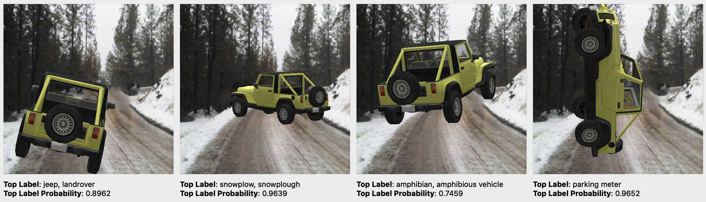
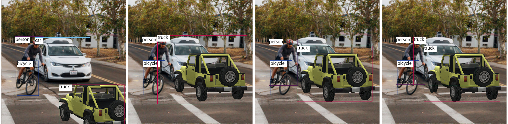
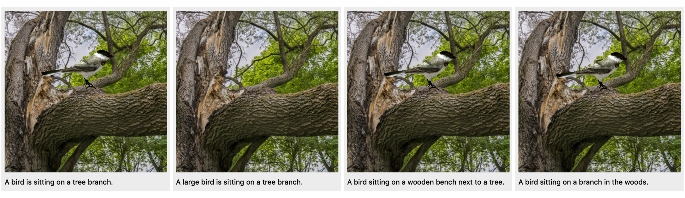

# Strike (With) A Pose

<p align="center">

</p>

This is the companion tool to the paper:

> [Michael A. Alcorn](https://sites.google.com/view/michaelaalcorn), Qi Li, Zhitao Gong, Chengfei Wang, Long Mai, Wei-Shinn Ku, and [Anh Nguyen](http://anhnguyen.me). [Strike (with) a pose: Neural networks are easily fooled by strange poses of familiar objects](https://arxiv.org/abs/1811.11553). arXiv 1811.11553. 2018.

 The tool allows you to generate adversarial poses of objects with a graphical user interface. Please note that the included jeep object does not meet the realism standards set in the paper. Unfortunately, the school bus object shown in the GIF is proprietary and cannot be distributed with the tool. A browser port of the tool (created by [Zhitao Gong](https://github.com/gongzhitaao)) can be found [here](https://airalcorn2.github.io/strike-with-a-pose/).

 If you use this tool for your own research, please cite:

```
@article{alcorn-2018-strike-with-a-pose,
    Author = {Alcorn, Michael A. and Li, Qi and Gong, Zhitao and Wang, Chengfei and Mai, Long and Ku, Wei-Shinn and Nguyen, Anh},
    Title = {{Strike (with) a Pose: Neural Networks Are Easily Fooled by Strange Poses of Familiar Objects}},
    Journal = {arXiv preprint},
    Year = {2018}
}
```

## Table of Contents

* [**Requirements**](#Requirements)
* [**Install/Run**](#Install-Run)
  * [**Linux**](#Linux)
  * [**Mac**](#Mac)
  * [**Windows**](#Windows)
* [**For Experts**](#For-Experts)
  * [**Using Different Objects and Backgrounds**](#Objects-and-Backgrounds)
  * [**Using Different Machine Learning Models**](#Machine-Learning-Models)
    * [**Image Classifier**](#Classifier)
    * [**Object Detector**](#Detector)
    * [**Captioner**](#Captioner)
    * [**Class Activation Mapper**](#Mapper)
  * [**Additional Features**](#Additional-Features)

## <a name="Requirements"></a>**Requirements**

* [**Git**](https://git-scm.com/book/en/v2/Getting-Started-Installing-Git) (Linux users only)
* **OpenGL** &ge; 3.3 (many computers satisfy this requirement)
  * On Linux, you can check your OpenGL version with the following command (requires `glx-utils` on Fedora or `mesa-utils` on Ubuntu):
  ```bash
  glxinfo | grep "OpenGL version"
  ```
  * On Windows, you can use [this tool](https://community.esri.com/groups/technical-support/blog/2012/03/15/what-version-of-opengl-do-i-have-and-do-i-have-the-latest-drivers-for-my-system).
* **Python 3** ([Mac](https://www.python.org/ftp/python/3.6.7/python-3.6.7-macosx10.9.pkg), [Windows](https://www.python.org/ftp/python/3.6.7/python-3.6.7-amd64.exe))
  * **Mac** users might also have to [install SSL certificates for Python](https://stackoverflow.com/a/42334357/1316276) by double-clicking the file found at:
  ```bash
  /Applications/Python\ 3.x/Install\ Certificates.command
  ```
  where `x` is the minor version of your particular Python 3 install. If you used the above link to install Python, the file will be at:
  ```bash
  /Applications/Python\ 3.6/Install\ Certificates.command
  ```
  * **Windows** users should make sure they [select the option to "Add Python 3.x to PATH"](https://docs.python.org/3/using/windows.html#installation-steps) where "x" is the minor version of the Python 3 you are installing. If you forget to select this option, you can also [add Python to the PATH yourself](https://projects.raspberrypi.org/en/projects/using-pip-on-windows/5).
  

## <a name="Install-Run"></a>Install/Run

Note: the tool takes a little while to start the first time it's run because it has to download the neural network.

### <a name="Linux"></a>Linux

In the terminal, enter the following commands:

```bash
# Clone the strike-with-a-pose repository.
git clone https://github.com/airalcorn2/strike-with-a-pose.git
# Move to the strike-with-a-pose directory.
cd strike-with-a-pose
# Install strike-with-a-pose.
pip3 install .
# Run strike-with-a-pose.
strike-with-a-pose
```

You can also run the tool (after installing) by starting Python and entering the following:

```python
from strike_with_a_pose import app
app.run_gui()
```

### <a name="Mac"></a>Mac

1. Click [here](https://github.com/airalcorn2/strike-with-a-pose/archive/master.zip) to download the tool ZIP.
2. Extract the ZIP somewhere convenient (like your desktop).
3. Double-click `install.command` in the `strike-with-a-pose-master/` directory.
  * Note: you may have to [adjust your security settings](https://www.mcvsd.org/tips/powerteacher/osx_unidentified_developers.html) to allow applications from "unidentified developers".
4. Double-click `strike-with-a-pose.command` in the `strike-with-a-pose-master/run/` directory.

### <a name="Windows"></a>Windows

1. Click [here](https://github.com/airalcorn2/strike-with-a-pose/archive/master.zip) to download the tool ZIP.
2. Extract the ZIP somewhere convenient (like your desktop).
3. Double-click `install.bat` in the `strike-with-a-pose-master\` directory.
 * Note: you may need to click "More info" and then "Run anyway".
4. Double-click `strike-with-a-pose.bat` in the `strike-with-a-pose-master\run\` directory.

## <a name="For-Experts"></a>For Experts

### <a name="Objects-and-Backgrounds"></a>Using Different Objects and Backgrounds

Users can test their own objects and backgrounds in Strike (With) A Pose by:
1. Adding the appropriate files to the `scene_files/` directory.
2. Modifying the `BACKGROUND_F`, `OBJ_F`, and `MTL_F` variables in  [`settings.py`](https://github.com/airalcorn2/strike-with-a-pose/blob/master/strike_with_a_pose/settings.py) accordingly.
3. Running the following command inside the `strike-with-a-pose/` directory:

```bash
PYTHONPATH=strike_with_a_pose python3 -m strike_with_a_pose.app
```

### <a name="Machine-Learning-Models"></a>Using Different Machine Learning Models

Users can experiment with different machine learning models in Strike (With) A Pose by:
1. Defining a model class that implements the `get_gui_comps`, `init_scene_comps`, `predict`, `render`, and `clear` functions (e.g., [`image_classifier.py`](https://github.com/airalcorn2/strike-with-a-pose/blob/master/strike_with_a_pose/image_classifier.py), [`object_detector.py`](https://github.com/airalcorn2/strike-with-a-pose/blob/master/strike_with_a_pose/object_detector.py), [`image_captioner.py`](https://github.com/airalcorn2/strike-with-a-pose/blob/master/strike_with_a_pose/image_captioner.py), and [`class_activation_mapper.py`](https://github.com/airalcorn2/strike-with-a-pose/blob/master/strike_with_a_pose/class_activation_mapper.py) [with major contributions by [Qi Li](https://www.linkedin.com/in/qili/)]).
2. Setting the `MODEL` variable in [`settings.py`](https://github.com/airalcorn2/strike-with-a-pose/blob/master/strike_with_a_pose/settings.py) accordingly.
3. Running the following command inside the `strike-with-a-pose/` directory:

```bash
PYTHONPATH=strike_with_a_pose python3 -m strike_with_a_pose.app
```

To use the image captioner model, first download and install the COCO API:

```python
git clone https://github.com/pdollar/coco.git
cd coco/PythonAPI/
make
python3 setup.py build
python3 setup.py install
```

#### <a name="Classifier"></a>Image Classifier



#### <a name="Detector"></a>Object Detector

"[The Elephant in the Room](https://arxiv.org/abs/1808.03305)"-like (Rosenfeld et al., 2018) examples:



#### <a name="Captioner"></a>Image Captioner



#### <a name="Mapper"></a>Class Activation Mapper

"[Learning Deep Features for Discriminative Localization](https://arxiv.org/pdf/1512.04150.pdf)"-like (Zhou et al., 2016) examples.


### <a name="Additional-Features"></a>Additional Features

Press **L** to toggle **Live** mode. When on, the machine learning model will continuously generate predictions. Note, **Live** mode can cause considerable lag if you do not have each of ***(1)*** a powerful GPU, ***(2)*** [CUDA](https://developer.nvidia.com/cuda-90-download-archive) installed, and ***(3)*** a [PyTorch version with CUDA](https://pytorch.org/get-started/locally/) support installed.

Press **X** to toggle the object's **teXture**, which is useful for making sure the directional light is properly interacting with your object. If the light looks funny, swapping/negating the vertex normal coordinates can usually fix it. See the [`fix_normals.py`](https://github.com/airalcorn2/strike-with-a-pose/blob/master/utils/fix_normals.py) script for an example.

Press **I** to bring up the **Individual** component selector. This feature allows you to display individual object components (as defined by each `newmtl` in the `.mtl` file) *by themselves*.

Press **C** to **Capture** a screenshot of the current render. Screenshots are saved in the directory where the tool is started.
